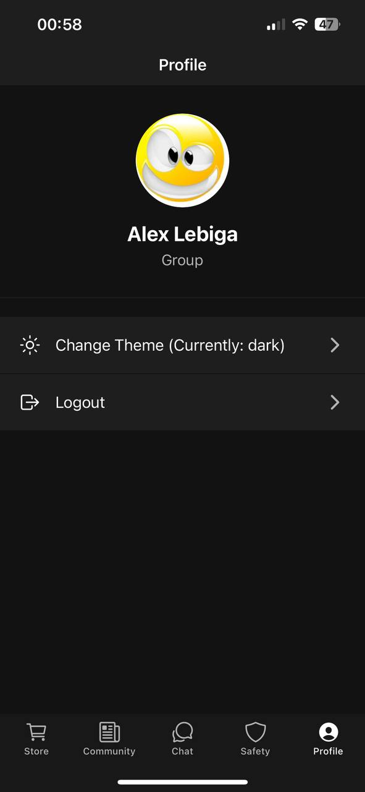

# Лабораторна робота №2 з дисципліни "Розробка мобільних застосунків"

**Виконав:** студент(ка) групи [Твоя група] [Твоє Прізвище, Ім'я, По-батькові]

## Тема роботи
Стилізація компонентів у React Native, списки, темізація. Відтворення UI мобільного застосунку Steam.

## Опис функціоналу застосунку "SteamClassicApp"
У рамках лабораторної роботи було розроблено мобільний застосунок, що імітує основні екрани та функціонал Steam, з такими особливостями:

* **Реалізовано 5 основних екранів:**
    * **Store (Магазин):** Відображення рекомендованих ігор та списку популярних ігор.
    * **Community (Спільнота):** Стрічка новин або постів.
    * **Chat (Чат):** Список чатів користувача.
    * **Safety (Безпека):** Інформація та налаштування Steam Guard.
    * **Profile (Профіль):** Інформація про користувача, можливість зміни теми та виходу з системи (симуляція).
* **Стилізація:** Усі компоненти стилізовані за допомогою бібліотеки `styled-components`.
* **Темізація:** Реалізовано світлу та темну теми оформлення з можливістю динамічного перемикання на екрані Профілю.
* **Списки:** Для відображення динамічних списків (ігри, новини, чати) використовується компонент `FlatList`.
* **Навігація:** Використана нижня навігація (BottomTabNavigator) на базі бібліотеки `React Navigation`.
* **Компонентний підхід:** Створено перевикористовувані компоненти для карток ігор, постів новин, елементів списку чатів тощо.

## Використані технології
* React Native
* Expo
* JavaScript (ES6+)
* Styled Components
* React Navigation (`@react-navigation/native`, `@react-navigation/bottom-tabs`)
* Expo Vector Icons
Нижче наведено скріншоти реалізованих екранів застосунку.

### Магазин (Store)

### Спільнота (Community)

### Чат (Chat)

### Безпека (Safety / Guard)

### Профіль (Profile)

**Темна тема:**

**Світла тема:**
