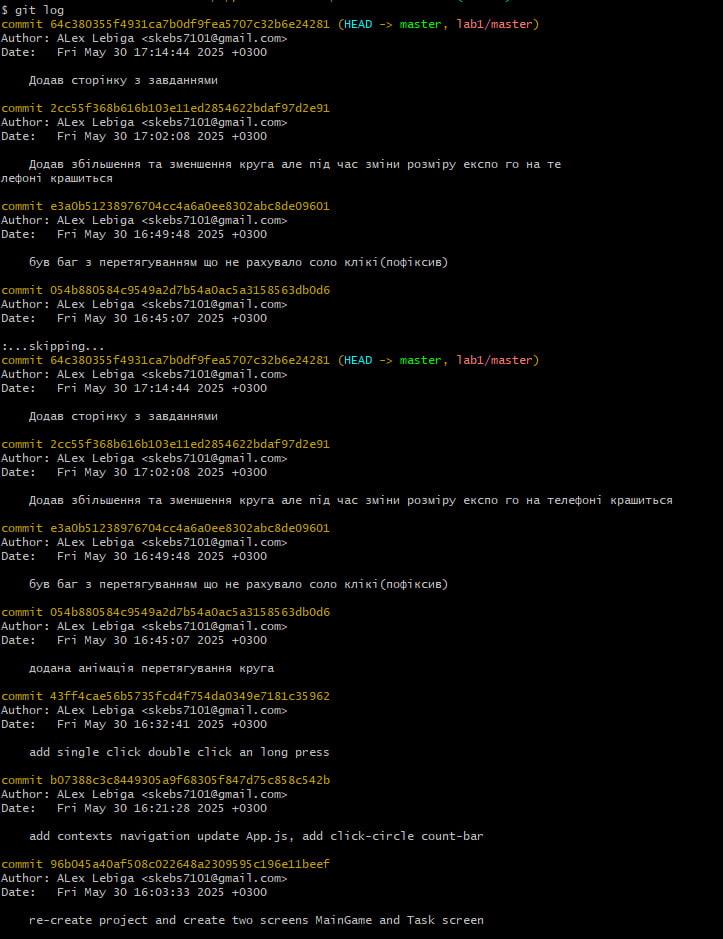
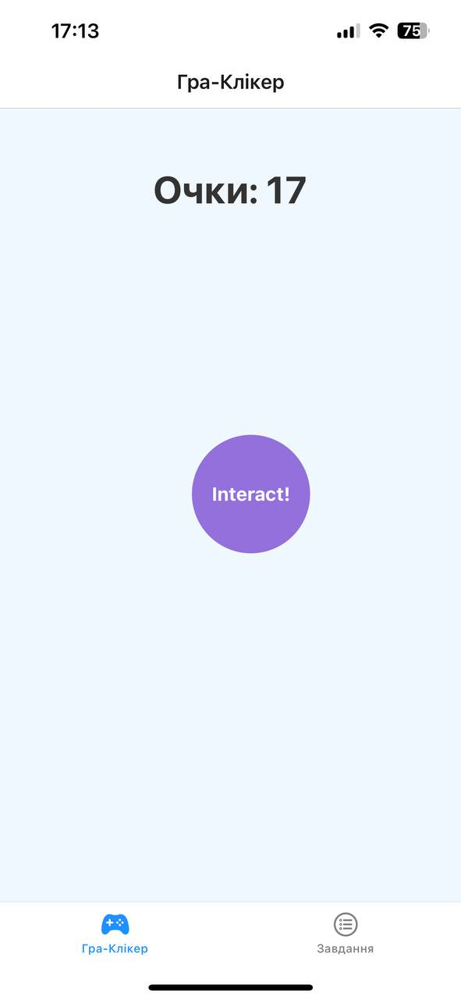
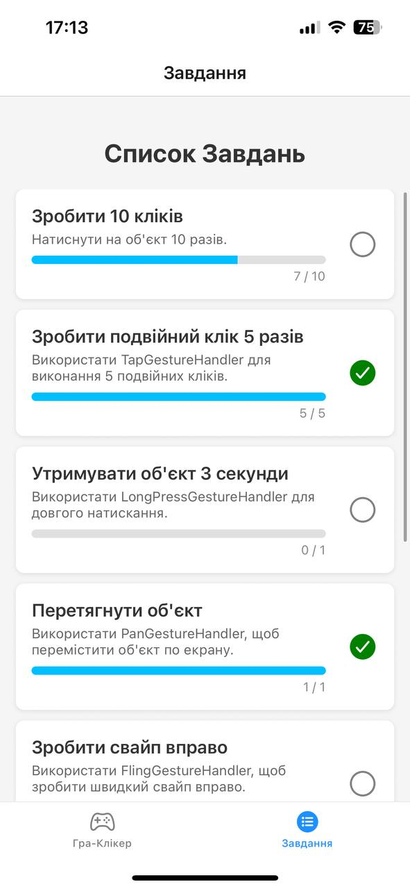

# Лабораторна робота №3 з дисципліни "Розробка мобільних застосунків"

**Виконав:** студент(ка) групи [ІПЗ-21-5] [Лебіга Олексій]

## Тема роботи
Використання жестів у React Native за допомогою `react-native-gesture-handler`. [cite: 1, 16]

**Commits:**

## Завдання
Розробити мобільний додаток – гру-клікер із використанням жестів, яка закріпить знання з теми взаємодії користувача з додатком у React Native. [cite: 2, 17]

## Опис функціоналу застосунку "ClickerG"
Мобільний додаток "ClickerG" є грою-клікером, де користувач взаємодіє з об'єктом на головному екрані за допомогою різних жестів для набору очок та виконання завдань.

### 1. Головний екран:
* **Лічильник очок:** Відображає поточну кількість набраних очок. [cite: 3, 18]
* **Інтерактивний об'єкт:** Об'єкт на екрані, який реагує на жести користувача. [cite: 3, 18]
* **Реалізовані жести:**
    * **Одинарний тап (`TapGestureHandler`):** Коротке натискання на об'єкт для отримання 1 очка. [cite: 3, 18]
    * **Подвійний тап (`TapGestureHandler`):** Подвійний клік по об'єкту для отримання 2 очок. [cite: 4, 19]
    * **Довге натискання (`LongPressGestureHandler`):** Утримання натискання на об'єкті протягом 3 секунд для отримання бонусних 10 очок. [cite: 4, 19]
    * **Перетягування (`PanGestureHandler`):** Можливість вільно перетягувати об'єкт по екрану. [cite: 5, 20] Виконання цього жесту зараховується у завданнях.
    * **Масштабування (`PinchGestureHandler`):** Можливість двома пальцями збільшувати або зменшувати об'єкт. [cite: 6, 21] Успішне масштабування дає бонусні 5 очок.
    * *(Примітка: `FlingGestureHandler` (свайп) було тимчасово пропущено через технічні складнощі під час реалізації).*

### 2. Сторінка завдань:
* Відображає список завдань, пов'язаних з використанням жестів та набором очок. [cite: 6, 21]
* Для кожного завдання показується його опис, поточний прогрес та статус виконання (виконано/не виконано). [cite: 11, 26]
* Список завдань реалізований за допомогою компонента `FlatList`. [cite: 11, 26]
* **Приклади завдань:**
    * Зробити 10 кліків. [cite: 6, 21]
    * Зробити подвійний клік 5 разів. [cite: 7, 22]
    * Утримувати об'єкт 3 секунди. [cite: 7, 22]
    * Перетягнути об'єкт. [cite: 8, 23]
    * Змінити розмір об'єкта. [cite: 10, 25]
    * Отримати 100 очок. [cite: 10, 25]
    * *(Завдання для свайпів вправо/вліво не активні через пропуск `FlingGestureHandler`)*.

### 3. Навігація:
* Для переходу між головним екраном гри та сторінкою завдань використовується нижня навігація (Bottom Tab Navigator) на базі бібліотеки `@react-navigation/native`. [cite: 12, 27]

## Використані технології
* React Native
* Expo
* JavaScript (ES6+)
* `react-native-gesture-handler` (для обробки жестів)
* `react-native-reanimated` (для анімацій, пов'язаних з жестами)
* `@react-navigation/native` та `@react-navigation/bottom-tabs` (для навігації)
* `@expo/vector-icons` (для іконок у навігації)
* React Context (для керування загальним станом гри: очки, прогрес завдань)
* `StyleSheet` (для стилізації компонентів)

**Головний екран гри:**

**Сторінка завдань:**

