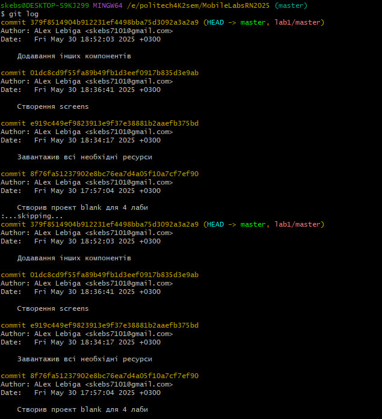
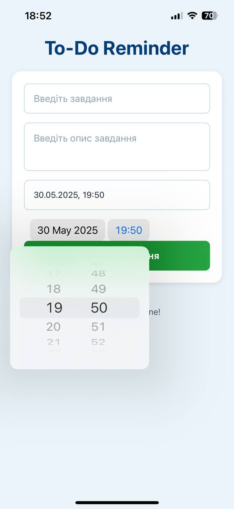
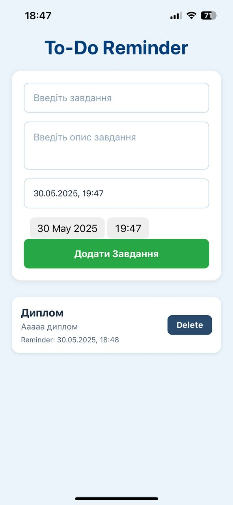
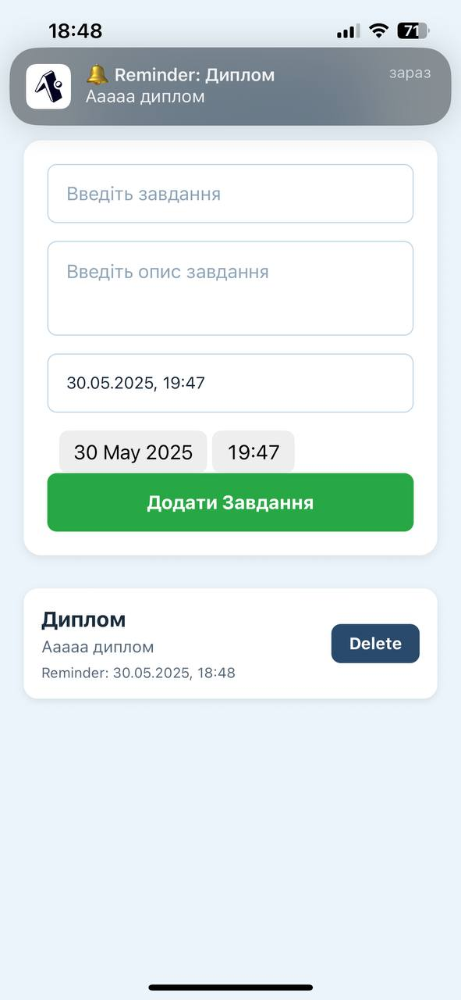

# Лабораторна робота №4 з дисципліни "Розробка мобільних застосунків"

**Виконав:** студент групи [ІПЗ-21-5] [Лебіга Олексій]

## Тема роботи
Робота з push-сповіщеннями у React Native за допомогою `expo-notification`. [cite: 1, 16]

## Результати роботи додатку

**Коміти.**

**Головний екран:**

**Додавання повідомлення:**

**Відображення повідомлення:**
