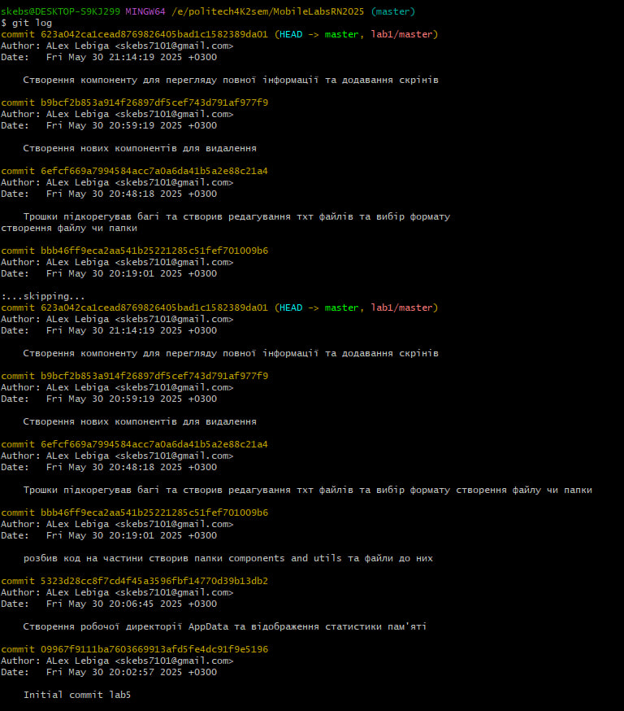
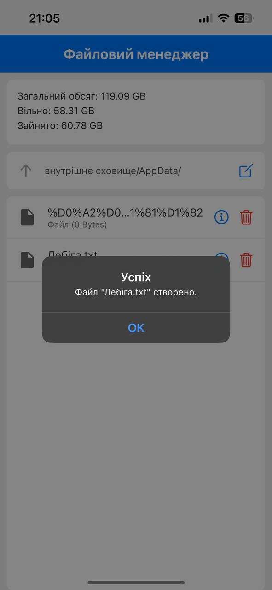
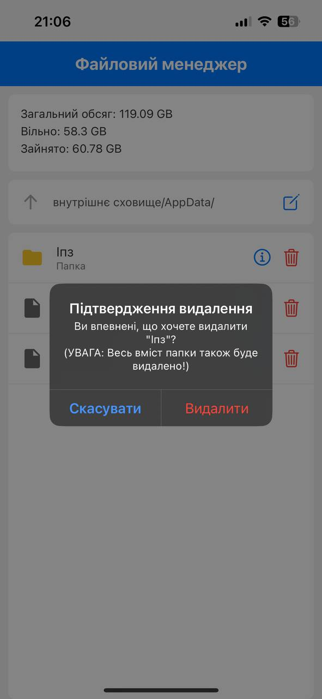

# Лабораторна робота №5 з дисципліни "Розробка мобільних застосунків"

**Виконав:** студент групи [ІПЗ-21-5] [Лебіга Олексій]

## Тема роботи
Робота з файловою системою в React Native з використанням бібліотеки `expo-file-system`[cite: 1].

## Мета роботи
Опанувати механізми роботи з локальною файловою системою мобільного пристрою на базі React Native, використовуючи можливості бібліотеки `expo-file-system`[cite: 1]. Закріпити навички реалізації базових операцій над файлами й папками, організації файлової навігації та аналізу стану файлової системи[cite: 2].

## Завдання
Розробити мобільний застосунок «Файловий менеджер»[cite: 3].

## Опис функціоналу застосунку "Файловий менеджер"
Мобільний застосунок "Файловий менеджер" надає користувачеві можливість взаємодіяти з файловою системою в межах ізольованої директорії додатку (`AppData`).

Основні функціональні можливості:

* **Навігація по файловій системі**[cite: 3]:
    * Відображення поточного шляху в межах директорії `AppData`[cite: 3].
    * Перегляд вмісту поточної директорії: список файлів та папок[cite: 4].
    * Можливість переходу у вкладені папки та повернення до батьківської директорії (кнопка "вгору")[cite: 4, 5].
* **Статистика пам'яті**[cite: 10]:
    * Відображення на головному екрані загального обсягу пам'яті пристрою, вільного та зайнятого простору[cite: 11].
* **Створення елементів**[cite: 6]:
    * Створення нової папки з введеною користувачем назвою у поточній директорії[cite: 6].
    * Створення нового текстового файлу (`.txt`) з введеною назвою та початковим вмістом[cite: 6].
* **Робота з файлами**:
    * **Зчитування**: Перегляд вмісту текстових файлів (`.txt`)[cite: 7].
    * **Редагування**: Модифікація вмісту текстових файлів (`.txt`) та збереження змін[cite: 7].
* **Видалення елементів**[cite: 8]:
    * Видалення обраного файлу або папки[cite: 8].
    * Перед видаленням виводиться діалогове вікно для підтвердження дії[cite: 8].
* **Перегляд детальної інформації**[cite: 9]:
    * Відображення атрибутів обраного файлу або папки: назва, тип (для файлів, за розширенням), розмір та дата останньої модифікації[cite: 9, 10].
* **Робоча директорія**:
    * Усі операції відбуваються в межах директорії `FileSystem.documentDirectory + 'AppData/'`[cite: 12, 13].
    * При першому запуску застосунку директорія `AppData/` створюється автоматично, якщо вона відсутня[cite: 12].

Для відображення списків використовується `FlatList`, а для введення даних – `TextInput` у поєднанні з модальними вікнами[cite: 16, 17].

## Використані технології
* React Native
* Expo
* JavaScript (ES6+)
* `expo-file-system`
* `@expo/vector-icons` (для іконок)
* React Navigation (якщо використовувалась для навігації між екранами, хоча в цій лабі все на одному екрані з модальними вікнами)
* Основні компоненти React Native: `View`, `Text`, `TouchableOpacity`, `FlatList`, `TextInput`, `Modal`, `StyleSheet`.
**COMMITS**

## Результати роботи додатку (Скріншоти)

1.  **Головний екран (коренева папка `AppData`, статистика пам'яті):**
    
2.  **Створення нової папки (модальне вікно та результат):**
    

    

    

    

    

    

    

    